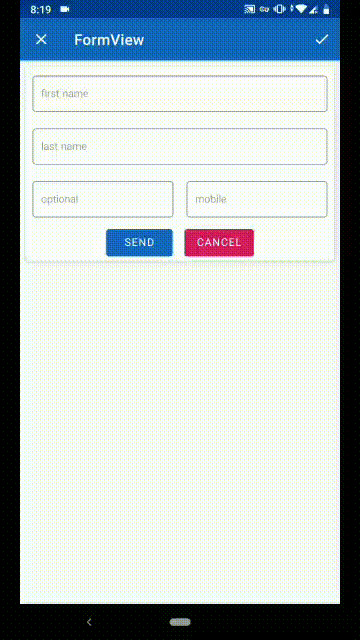

# FormView
for check required text in EditText



# Updates
 1.set reset form to optional
 
 2.for reset form ```fv.resetForm()```

# Installation
```gradle
allprojects {
    repositories {
        ...
        maven { url 'https://jitpack.io' }
    }
}

//add this to your dependencies
implementation 'com.github.alimodares2003:FormView:1.0.3'
```
# How to use

1.add FromView to root layout. also you can add anywhere. 

```xml
<?xml version="1.0" encoding="utf-8"?>
<ir.adp.library.FormView
        xmlns:android="http://schemas.android.com/apk/res/android"
        android:layout_width="match_parent"
        android:layout_height="match_parent"
        android:orientation="vertical">
    
    <!--you can write Edittext and button and other view-->

</ir.adp.library.FormView>
```
2. for button click hundle:

```kotlin
      fv.setOnSubmitClickListener {
          val et = et.getText()
          val et1 = et1.getText()
          val et2 = et2.getText()
          val et3 = et3.getText()
          Toast.makeText(this, "$et $et1 $et2 $et3", Toast.LENGTH_LONG).show()
          //your code
     }
 ```
3.for add submit to toolbar item :

```kotlin
   override fun onCreateOptionsMenu(menu: Menu): Boolean {
        menuInflater.inflate(R.menu.item_menu, menu)
        fv.onNavigationItemSelected(menu){
            Toast.makeText(this, "clicked", Toast.LENGTH_LONG).show()
        }
        return true
    }
```

4.for change error text:
```kotlin
fv.errorText = "is required"
```
5. for optional you can add this ```android:tag="optional"``` to TextInputLayout

# Important explanations
1.your button id must be "submit"

2.your toolbar item id must be "submit"

3.EditText must be in TextInputLayout
